# MCPizer

MCPizer lets your AI assistant (Claude, VS Code, etc.) call any REST API or gRPC service by automatically converting their schemas into MCP (Model Context Protocol) tools.

**New in v0.4.0:** 
- 🚀 GitHub integration - fetch schemas directly with `github://` URLs
- 📄 .proto file support - use gRPC without reflection enabled
- 🔐 Private repo support - automatic authentication via `gh` CLI

## What is MCPizer?

MCPizer is a server that:
- **Auto-discovers** API schemas from your services (OpenAPI/Swagger, gRPC reflection, .proto files)
- **Converts** them into tools your AI can use
- **Handles** all the API calls with proper types and error handling

Works with any framework that exposes OpenAPI schemas (FastAPI, Spring Boot, Express, etc.) or gRPC services (with reflection or .proto files). No code changes needed in your APIs - just point MCPizer at them!

## How it Works


### Architecture Overview


## Installation

```bash
# Install MCPizer
go install github.com/i2y/mcpizer/cmd/mcpizer@latest

# Verify installation
mcpizer --help
```

### Usage Examples

```bash
# Use default config file (configs/mcpizer.yaml)
mcpizer

# Specify config file via command line (highest priority)
mcpizer -config=/path/to/config.yaml

# Use GitHub-hosted config
mcpizer -config=github://myorg/configs/mcpizer-prod.yaml

# Or via environment variable
export MCPIZER_CONFIG_FILE=/path/to/config.yaml
mcpizer

# STDIO mode with custom config
mcpizer -transport=stdio -config=./my-config.yaml
```

> **Note**: Make sure `$GOPATH/bin` is in your PATH. If not installed, [install Go first](https://golang.org/doc/install).

## Quick Start

### Step 1: Configure Your APIs

Create a config file with your API endpoints:

```yaml
schema_sources:
  # Production APIs with HTTPS
  - https://api.mycompany.com              # Auto-discovers OpenAPI
  - https://api.example.com/openapi.json   # Direct schema URL
  
  # GitHub-hosted schemas (NEW: use github:// URLs)
  - github://myorg/api-specs/main/user-api.yaml     # Uses gh CLI auth
  - github://OAI/OpenAPI-Specification/examples/v3.0/petstore.yaml@master
  - https://raw.githubusercontent.com/myorg/api-specs/main/user-api.yaml  # Direct URL also works
  
  # Internal services (FastAPI, Spring Boot, etc.)
  - http://my-fastapi-app:8000     # Auto-discovers at /openapi.json, /docs
  - http://spring-service:8080     # Auto-discovers at /v3/api-docs
  
  # gRPC services (must have reflection enabled)
  - grpc://my-grpc-service:50051
  
  # gRPC with .proto files (NEW! - no reflection needed)
  - url: https://raw.githubusercontent.com/myorg/protos/main/service.proto
    server: grpc://production.example.com:50051
  
  # Or use github:// for private repos (uses gh CLI)
  - url: github://myorg/protos/service.proto@main
    server: grpc://production.example.com:50051
  
  # Local development
  - http://localhost:3000
  - grpc://localhost:50052
  
  # Public test APIs
  - https://petstore3.swagger.io/api/v3/openapi.json
  - grpc://grpcb.in:9000
```

### Step 2: Choose Your Transport Mode

MCPizer supports two transport modes:

#### 📝 **STDIO Mode** (for clients that manage process lifecycle)

Used by clients that start MCPizer as a subprocess and communicate via standard input/output.

**Example: Claude Desktop**

Add to your configuration file:
- **macOS:** `~/Library/Application Support/Claude/claude_desktop_config.json`
- **Windows:** `%APPDATA%\Claude\claude_desktop_config.json`
- **Linux:** `~/.config/Claude/claude_desktop_config.json`

```json
{
  "mcpServers": {
    "mcpizer": {
      "command": "mcpizer",
      "args": ["-transport=stdio", "-config=/path/to/your/config.yaml"]
    }
  }
}
```

The client will start MCPizer automatically when needed.

#### 🌐 **SSE Mode** (Server-Sent Events over HTTP)

Used by clients that connect to a running MCPizer server via HTTP.

```bash
# Start MCPizer server (if your client doesn't start it automatically)
mcpizer

# Server runs at http://localhost:8080/sse
```

Configure your MCP client to connect to `http://localhost:8080/sse`

Note: Some clients may start the server automatically, while others require manual startup.

#### 🧪 **For Testing/Development**

```bash
# Quick test - list available tools
mcpizer -transport=stdio << 'EOF'
{"jsonrpc":"2.0","method":"tools/list","id":1}
EOF

# Interactive mode
mcpizer -transport=stdio
```

## Usage Guide

### When to Use What

| I want to... | Do this... |
|--------------|------------|
| Use my API with Claude Desktop | Add config to `claude_desktop_config.json` (see Quick Start) |
| Test if my API works with MCP | Run `mcpizer -transport=stdio` and check tool list |
| Run as a background service | Use SSE mode with `mcpizer` (no args) |
| Debug connection issues | Set `MCPIZER_LOG_LEVEL=debug` |
| Use a private GitHub repo | Use `github://` URLs (requires `gh` CLI) |
| Use gRPC without reflection | Use .proto files with `server` field |
| Multiple environments, same API | Use same schema file, different `server` values |

### Configuration

MCPizer looks for config in this order:
1. `-config` command line flag (highest priority)
2. `$MCPIZER_CONFIG_FILE` environment variable
3. `configs/mcpizer.yaml` (default)

#### Supported API Types

**REST APIs (OpenAPI/Swagger)**
```yaml
schema_sources:
  # Auto-discovery from base URL
  - https://api.production.com      # Tries /openapi.json, /swagger.json, etc.
  - http://internal-api:8000        # For internal services
  
  # Direct schema URLs
  - https://api.example.com/v3/openapi.yaml
  - https://raw.githubusercontent.com/company/api-specs/main/openapi.json
```

### Separate Schema Files and API Servers

MCPizer supports OpenAPI schema files that are hosted separately from the actual API server. This is useful when:

1. **The API doesn't expose its own schema** - You can write an OpenAPI spec for any API
2. **Schema is managed separately** - Documentation team maintains schemas independently
3. **Multiple environments** - One schema file for dev/staging/production APIs

**How it works:**
```yaml
schema_sources:
  # Schema file points to production API
  - https://docs.company.com/api/v1/openapi.yaml
  
  # Local schema file for external API
  - ./schemas/third-party-api.yaml
```

The OpenAPI spec contains server URLs:
```yaml
servers:
  - url: https://api.production.com
    description: Production server
  - url: https://api.staging.com
    description: Staging server
```

MCPizer will:
1. Fetch the schema from the schema_sources URL
2. Read the `servers` section from the OpenAPI spec
3. Use the first available server URL for actual API calls

**Example: Creating OpenAPI spec for an API without documentation**

If you have an API at `https://internal-api.company.com` that doesn't provide OpenAPI:

1. Write your own OpenAPI spec:
```yaml
openapi: 3.0.0
info:
  title: Internal API
  version: 1.0.0
servers:
  - url: https://internal-api.company.com
paths:
  /users:
    get:
      summary: List users
      responses:
        '200':
          description: Success
          content:
            application/json:
              schema:
                type: array
                items:
                  type: object
                  properties:
                    id: {type: integer}
                    name: {type: string}
```

2. Host it anywhere:
   - GitHub: `https://raw.githubusercontent.com/yourorg/specs/main/api.yaml`
   - S3/CDN: `https://cdn.company.com/api-specs/v1/openapi.json`
   - Local file: `./schemas/third-party-api.yaml`
3. Point MCPizer to your schema file

### Auto-Discovery Process


Supported frameworks:
- **FastAPI**: `/openapi.json`, `/docs/openapi.json`
- **Spring Boot**: `/v3/api-docs`, `/swagger-ui/swagger.json`  
- **Express/NestJS**: `/api-docs`, `/swagger.json`
- **Rails**: `/api/v1/swagger.json`, `/apidocs`
- [See full list](internal/adapter/outbound/openapi/autodiscover.go)

**gRPC Services**
```yaml
schema_sources:
  # Using gRPC reflection (requires reflection enabled on server)
  - grpc://your-grpc-host:50051     # Your service
  - grpc://grpcb.in:9000            # Public test service
  
  # Using .proto files (NEW! - no reflection needed)
  - url: https://raw.githubusercontent.com/grpc/grpc-go/master/examples/helloworld/helloworld/helloworld.proto
    server: grpc://production.example.com:50051
  
  # Private GitHub .proto files (uses gh CLI authentication)
  - url: github://myorg/protos/user-service.proto
    server: grpc://user-service:50051
  
  # With specific branch/tag
  - url: github://grpc/grpc-go/examples/helloworld/helloworld/helloworld.proto@v1.65.0
    server: grpc://production.example.com:50051
```

**Option 1: gRPC Reflection** (requires [reflection](https://github.com/grpc/grpc/blob/master/doc/server-reflection.md) enabled):
```go
// In your gRPC server
import "google.golang.org/grpc/reflection"
reflection.Register(grpcServer)
```

**Option 2: .proto Files** (NEW! - more secure, no reflection needed):
- Host your `.proto` files anywhere (GitHub, S3, CDN, etc.)
- GitHub URLs (`github://`) automatically use `gh` CLI authentication
- Specify the `server` endpoint separately
- Perfect for production where reflection is disabled
- Allows schema versioning and CI/CD validation

For alternative reflection implementations, see:
- [connectrpc/grpcreflect-go](https://github.com/connectrpc/grpcreflect-go)  Connect-Go's reflection implementation

**Local Files**
```yaml
schema_sources:
  - ./api-spec.json
  - /path/to/openapi.yaml
```

### GitHub Integration (NEW!)

MCPizer can fetch schemas directly from GitHub repositories using the `gh` CLI tool - including both OpenAPI and .proto files:

```yaml
schema_sources:
  # OpenAPI schemas from GitHub
  - github://owner/repo/path/to/openapi.yaml
  - github://microsoft/api-guidelines/graph/openapi.yaml@v1.0
  
  # .proto files from GitHub (NEW!)
  - url: github://grpc/grpc-go/examples/helloworld/helloworld/helloworld.proto@master
    server: grpc://production.example.com:50051
  
  # Private repositories (uses gh CLI authentication)
  - github://myorg/private-apis/user-api.yaml
  - url: github://myorg/private-protos/service.proto@v2.0
    server: grpc://internal-service:50051
  
  # Load MCPizer config itself from GitHub!
  # Set MCPIZER_CONFIG_FILE=github://myorg/configs/mcpizer.yaml
```

**Benefits:**
- ✅ Works with private repositories (uses `gh` authentication)
- ✅ Specify branches/tags with `@ref` syntax
- ✅ No need to manage raw GitHub URLs or tokens
- ✅ Supports both OpenAPI and .proto files
- ✅ Config files can also be stored in GitHub

**Requirements:**
- Install GitHub CLI: `brew install gh` (macOS) or [see docs](https://cli.github.com/)
- Authenticate: `gh auth login`

### Environment Variables

| Variable | Default | When to use |
|----------|---------|-------------|
| `MCPIZER_CONFIG_FILE` | `~/.mcpizer.yaml` | Different config per environment<br/>Can be `github://` URL! |
| `MCPIZER_LOG_LEVEL` | `info` | Set to `debug` for troubleshooting |
| `MCPIZER_LOG_FILE` | `/tmp/mcpizer.log` | Change log location (STDIO mode) |
| `MCPIZER_LISTEN_ADDR` | `:8080` | Change port (SSE mode) |
| `MCPIZER_HTTP_CLIENT_TIMEOUT` | `30s` | Slow APIs need more time |

## Common Scenarios

### "I want Claude to use my local FastAPI app"

```bash
# 1. Your FastAPI runs on port 8000
python -m uvicorn main:app

# 2. Install MCPizer
go install github.com/i2y/mcpizer/cmd/mcpizer@latest

# 3. Configure (~/.mcpizer.yaml)
echo "schema_sources:\n  - http://localhost:8000" > ~/.mcpizer.yaml

# 4. Add to Claude Desktop config and restart
# Now ask Claude: "What endpoints are available?"
```

### "I want to test if MCPizer sees my API"

```bash
# Quick check - what tools are available?
mcpizer -transport=stdio << 'EOF'
{"jsonrpc":"2.0","method":"tools/list","id":1}
EOF

# Should list all your API endpoints as tools
```

### "My API needs authentication"

```yaml
# For APIs that require authentication headers
schema_sources:
  # Object format with headers (for fetching schemas)
  - url: https://api.example.com/openapi.json
    headers:
      Authorization: "Bearer YOUR_API_TOKEN"
      X-API-Key: "YOUR_API_KEY"
  
  # GitHub private repos (automatic auth via gh CLI)
  - github://myorg/private-apis/openapi.yaml     # No headers needed!
  - url: github://myorg/private-protos/api.proto  # gh handles auth
    server: grpc://api.example.com:50051
  
  # Simple format (no auth required)
  - https://public-api.example.com/swagger.json
```

Note: These headers are used when fetching the schema files. Headers required for actual API calls should be defined in the OpenAPI spec itself.

### "I'm getting 'no tools available'"

```bash
# 1. Check if your API is running
curl http://localhost:8000/openapi.json  # Should return JSON

# 2. Run with debug logging
MCPIZER_LOG_LEVEL=debug mcpizer -transport=stdio

# 3. Check the log file
tail -f /tmp/mcpizer.log
```

### "I want to use my company's gRPC services"

**Option 1: If reflection is enabled**
```yaml
# Simple - just point to the service
schema_sources:
  - grpc://my-service:50051
```

**Option 2: Using .proto files (recommended)**
```yaml
# More secure - no reflection needed in production
schema_sources:
  # From GitHub (private repos supported)
  - url: github://mycompany/protos/user-service.proto@v1.0.0
    server: grpc://user-service.prod:443
  
  # From any HTTPS URL
  - url: https://cdn.mycompany.com/schemas/order-service.proto
    server: grpc://order-service.prod:443
```

### "I want to run MCPizer as a service"

**Option 1: Direct binary execution**
```bash
# Run in background with specific config
mcpizer -config /etc/mcpizer/production.yaml &

# Or use systemd (create /etc/systemd/system/mcpizer.service)
[Unit]
Description=MCPizer MCP Server
After=network.target

[Service]
Type=simple
ExecStart=/usr/local/bin/mcpizer
Environment="MCPIZER_CONFIG_FILE=/etc/mcpizer/production.yaml"
Restart=always
User=mcpizer

[Install]
WantedBy=multi-user.target
```


## Troubleshooting

### Debug Commands

```bash
# See what's happening
MCPIZER_LOG_LEVEL=debug mcpizer -transport=stdio

# Watch logs (STDIO mode)
tail -f /tmp/mcpizer.log

# Test your API is accessible
curl http://your-api-host:8000/openapi.json

# Test gRPC reflection
grpcurl -plaintext your-grpc-host:50051 list
```

### Common Issues

| Problem | Solution |
|---------|----------|
| "No tools available" | • Check API is running<br>• Try direct schema URL<br>• Check debug logs |
| "Connection refused" | • Wrong port?<br>• Check if API is running<br>• Firewall blocking? |
| "String should have at most 64 characters" | Update MCPizer - this is fixed in latest version |
| gRPC "connection refused" | • Enable reflection in your gRPC server<br>• Check with `grpcurl`<br>• Or use .proto file approach instead |
| "Schema not found at base URL" | • Specify exact schema path<br>• Check if API exposes OpenAPI |
| ".proto file missing server" | • Add `server: grpc://host:port` to your config<br>• Required for .proto files |

## Examples

### Complete Flow Example

Here's how MCPizer works with a FastAPI service:

```mermaid
flowchart LR
    subgraph "Your FastAPI App"
        API[FastAPI Service<br/>Port 8000]
        Schema["/openapi.json<br/>Auto-generated"]
        API --> Schema
    end
    
    subgraph "MCPizer Config"
        Config["~/.mcpizer.yaml<br/>schema_sources:<br/>http://my-fastapi:8000"]
    end
    
    subgraph "MCPizer Process"
        Discover["(1) Discover schema<br/>at /openapi.json"]
        Convert["(2) Convert endpoints<br/>to MCP tools"]
        Register["(3) Register tools<br/>with MCP protocol"]
        
        Discover --> Convert
        Convert --> Register
    end
    
    subgraph "AI Assistant"
        List["List tools:<br/>• get_item<br/>• create_item<br/>• update_item"]
        Call["Call: get_item<br/>{item_id: 123}"]
        Result["Result:<br/>{id: 123, name: 'Test'}"]
        
        List --> Call
        Call --> Result
    end
    
    Config --> Discover
    Schema --> Discover
    Register --> List
    Call -->|HTTP GET /items/123| API
    API -->|JSON Response| Result
    
    style API fill:#e8f4fd
    style Config fill:#fff4e6
    style Register fill:#e8f5e9
    style Result fill:#f3e5f5
```



### FastAPI Example

```python
# main.py
from fastapi import FastAPI

app = FastAPI()

@app.get("/items/{item_id}")
def get_item(item_id: int, q: str = None):
    return {"item_id": item_id, "q": q}

# MCPizer auto-discovers at http://localhost:8000/openapi.json
```

### gRPC Example

**Option 1: Using Reflection**
```go
// Enable reflection for MCPizer
import "google.golang.org/grpc/reflection"

func main() {
    s := grpc.NewServer()
    pb.RegisterYourServiceServer(s, &server{})
    reflection.Register(s)  // This line enables MCPizer support
    s.Serve(lis)
}
```

**Option 2: Using .proto Files (Recommended for Production)**
```yaml
# config.yaml
schema_sources:
  # Your .proto file in version control
  - url: github://myorg/protos/user-service.proto@v1.0.0
    server: grpc://user-service.prod.example.com:443
  
  # Multiple environments, same schema
  - url: github://myorg/protos/user-service.proto@v1.0.0
    server: grpc://user-service.staging.example.com:443
```

Benefits:
- ✅ No reflection needed in production
- ✅ Version-controlled schemas
- ✅ CI/CD can validate schemas
- ✅ Same .proto for multiple environments

## Development

```bash
# Run tests
go test ./...

# Build locally
go build -o mcpizer ./cmd/mcpizer

# Run with example services (includes Petstore, gRPC test service, Jaeger)
docker compose up

# Run individual examples
cd examples/fastapi && pip install -r requirements.txt && python main.py
```

See [examples/](examples/) for more complete examples:
- [proto-config.yaml](examples/proto-config.yaml) - Using .proto files with multiple environments
- [fastapi/](examples/fastapi/) - FastAPI integration example
- [grpc-service/](examples/grpc-service/) - gRPC service with reflection

## Contributing

Contributions welcome! Please:
1. Check existing issues first
2. Fork and create a feature branch
3. Add tests for new functionality
4. Submit a PR

## License

MIT - see [LICENSE](LICENSE)
