# MCPizer

MCPizer lets your AI assistant (Claude, VS Code, etc.) call any REST API or gRPC service by automatically converting their schemas into MCP (Model Context Protocol) tools.

## What is MCPizer?

MCPizer is a server that:
- **Auto-discovers** API schemas from your services (OpenAPI/Swagger, gRPC reflection)
- **Converts** them into tools your AI can use
- **Handles** all the API calls with proper types and error handling

Works with any framework that exposes OpenAPI schemas (FastAPI, Spring Boot, Express, etc.) or gRPC services with reflection enabled. No code changes needed in your APIs - just point MCPizer at them!

## How it Works


### Architecture Overview


## Installation

```bash
# Install MCPizer
go install github.com/i2y/mcpizer/cmd/mcpizer@latest

# Verify installation
mcpizer --help
```

> **Note**: Make sure `$GOPATH/bin` is in your PATH. If not installed, [install Go first](https://golang.org/doc/install).

## Quick Start

### Step 1: Configure Your APIs

Create `~/.mcpizer.yaml` with your API endpoints:

```yaml
schema_sources:
  # FastAPI/Django - auto-discovers OpenAPI at /openapi.json, /docs, etc.
  - http://my-fastapi-app:8000
  
  # Spring Boot - auto-discovers at /v3/api-docs, /swagger.json
  - http://spring-service.local:8080
  
  # Direct schema URLs (if auto-discovery doesn't work)
  - https://api.example.com/openapi.json
  
  # gRPC services (must have reflection enabled)
  - grpc://my-grpc-service:50051
  
  # For local development (when running on same machine)
  - http://localhost:3000
  - grpc://localhost:50052
  
  # Public test APIs
  - https://petstore3.swagger.io/api/v3/openapi.json
  - grpc://grpcb.in:9000
```

### Step 2: Choose Your Use Case

#### 🤖 **For Claude Desktop**

Add MCPizer to your Claude Desktop configuration file:

**macOS:**
`~/Library/Application Support/Claude/claude_desktop_config.json`

**Windows:**
`%APPDATA%\Claude\claude_desktop_config.json`

**Linux:**
`~/.config/Claude/claude_desktop_config.json`

```json
{
  "mcpServers": {
    "mcpizer": {
      "command": "mcpizer",
      "args": ["-transport=stdio"]
    }
  }
}
```

Restart Claude Desktop. Ask Claude: "What APIs are available?" or "Create a new pet named Fluffy"

#### 💻 **For VS Code (Continue, Cody, etc.)**

1. Start MCPizer:
   ```bash
   mcpizer
   ```

2. Configure your extension to use `http://localhost:8080/sse`

#### 🧪 **For Testing/Development**

```bash
# Quick test - list available tools
mcpizer -transport=stdio << 'EOF'
{"jsonrpc":"2.0","method":"tools/list","id":1}
EOF

# Interactive mode
mcpizer -transport=stdio
```

## Usage Guide

### When to Use What

| I want to... | Do this... |
|--------------|------------|
| Use my API with Claude Desktop | Add config to `claude_desktop_config.json` (see Quick Start) |
| Test if my API works with MCP | Run `mcpizer -transport=stdio` and check tool list |
| Run as a background service | Use SSE mode with `mcpizer` (no args) |
| Debug connection issues | Set `MCPIZER_LOG_LEVEL=debug` |
| Use a private API | Add full schema URL to config file |

### Configuration

MCPizer looks for config in this order:
1. `$MCPIZER_CONFIG_FILE` environment variable
2. `./configs/mcpizer.yaml` 
3. `~/.mcpizer.yaml`

#### Supported API Types

**REST APIs (OpenAPI/Swagger)**
```yaml
schema_sources:
  # Just the base URL - we'll find the schema
  - http://your-api-host:8000      # Tries /openapi.json, /swagger.json, etc.
  
  # Or specify exact schema location
  - https://api.example.com/v3/openapi.yaml
```

### Auto-Discovery Process

```mermaid
graph TD
    Start["Base URL provided:<br/>http://your-api:8000"] 
    
    Try1["/openapi.json<br/>FastAPI default"]
    Try2["/docs/openapi.json<br/>FastAPI alt"]
    Try3["/swagger.json<br/>Swagger 2.0"]
    Try4["/v3/api-docs<br/>Spring Boot"]
    Try5["...more paths..."]
    
    Found["✓ Schema found!<br/>Parse and convert"]
    NotFound["✗ Not found<br/>Try direct URL"]
    
    Start --> Try1
    Try1 -->|404| Try2
    Try2 -->|404| Try3
    Try3 -->|404| Try4
    Try4 -->|404| Try5
    
    Try1 -->|200| Found
    Try2 -->|200| Found
    Try3 -->|200| Found
    Try4 -->|200| Found
    
    Try5 -->|All fail| NotFound
    
    style Start fill:#e3f2fd
    style Found fill:#c8e6c9
    style NotFound fill:#ffcdd2
```



Supported frameworks:
- **FastAPI**: `/openapi.json`, `/docs/openapi.json`
- **Spring Boot**: `/v3/api-docs`, `/swagger-ui/swagger.json`  
- **Express/NestJS**: `/api-docs`, `/swagger.json`
- **Rails**: `/api/v1/swagger.json`, `/apidocs`
- [See full list](internal/adapter/outbound/openapi/autodiscover.go)

**gRPC Services**
```yaml
schema_sources:
  - grpc://your-grpc-host:50051     # Your service
  - grpc://grpcb.in:9000            # Public test service
```

⚠️ gRPC requires [reflection](https://github.com/grpc/grpc/blob/master/doc/server-reflection.md) enabled:
```go
// In your gRPC server
import "google.golang.org/grpc/reflection"
reflection.Register(grpcServer)
```

For alternative reflection implementations, see:
- [connectrpc/grpcreflect-go](https://github.com/connectrpc/grpcreflect-go)  Connect-Go's reflection implementation

**Local Files**
```yaml
schema_sources:
  - ./api-spec.json
  - /path/to/openapi.yaml
```

### Environment Variables

| Variable | Default | When to use |
|----------|---------|-------------|
| `MCPIZER_CONFIG_FILE` | `~/.mcpizer.yaml` | Different config per environment |
| `MCPIZER_LOG_LEVEL` | `info` | Set to `debug` for troubleshooting |
| `MCPIZER_LOG_FILE` | `/tmp/mcpizer.log` | Change log location (STDIO mode) |
| `MCPIZER_LISTEN_ADDR` | `:8080` | Change port (SSE mode) |
| `MCPIZER_HTTP_CLIENT_TIMEOUT` | `30s` | Slow APIs need more time |

## Common Scenarios

### "I want Claude to use my local FastAPI app"

```bash
# 1. Your FastAPI runs on port 8000
python -m uvicorn main:app

# 2. Install MCPizer
go install github.com/i2yeo/mcpizer/cmd/mcpizer@latest

# 3. Configure (~/.mcpizer.yaml)
echo "schema_sources:\n  - http://localhost:8000" > ~/.mcpizer.yaml

# 4. Add to Claude Desktop config and restart
# Now ask Claude: "What endpoints are available?"
```

### "I want to test if MCPizer sees my API"

```bash
# Quick check - what tools are available?
mcpizer -transport=stdio << 'EOF'
{"jsonrpc":"2.0","method":"tools/list","id":1}
EOF

# Should list all your API endpoints as tools
```

### "My API needs authentication"

```yaml
# For APIs that require authentication headers
schema_sources:
  # Object format with headers
  - url: https://api.example.com/openapi.json
    headers:
      Authorization: "Bearer YOUR_API_TOKEN"
      X-API-Key: "YOUR_API_KEY"
  
  # Simple format (no auth required)
  - https://public-api.example.com/swagger.json
```

Note: These headers are used when fetching the OpenAPI schema. Headers required for API calls should be defined in the OpenAPI spec itself.

### "I'm getting 'no tools available'"

```bash
# 1. Check if your API is running
curl http://localhost:8000/openapi.json  # Should return JSON

# 2. Run with debug logging
MCPIZER_LOG_LEVEL=debug mcpizer -transport=stdio

# 3. Check the log file
tail -f /tmp/mcpizer.log
```

### "I want to run MCPizer as a service"

**Option 1: Direct binary execution**
```bash
# Run in background with specific config
mcpizer -config /etc/mcpizer/production.yaml &

# Or use systemd (create /etc/systemd/system/mcpizer.service)
[Unit]
Description=MCPizer MCP Server
After=network.target

[Service]
Type=simple
ExecStart=/usr/local/bin/mcpizer
Environment="MCPIZER_CONFIG_FILE=/etc/mcpizer/production.yaml"
Restart=always
User=mcpizer

[Install]
WantedBy=multi-user.target
```


## Troubleshooting

### Debug Commands

```bash
# See what's happening
MCPIZER_LOG_LEVEL=debug mcpizer -transport=stdio

# Watch logs (STDIO mode)
tail -f /tmp/mcpizer.log

# Test your API is accessible
curl http://your-api-host:8000/openapi.json

# Test gRPC reflection
grpcurl -plaintext your-grpc-host:50051 list
```

### Common Issues

| Problem | Solution |
|---------|----------|
| "No tools available" | • Check API is running<br>• Try direct schema URL<br>• Check debug logs |
| "Connection refused" | • Wrong port?<br>• Check if API is running<br>• Firewall blocking? |
| "String should have at most 64 characters" | Update MCPizer - this is fixed in latest version |
| gRPC "connection refused" | • Enable reflection in your gRPC server<br>• Check with `grpcurl` |
| "Schema not found at base URL" | • Specify exact schema path<br>• Check if API exposes OpenAPI |

## Examples

### Complete Flow Example

Here's how MCPizer works with a FastAPI service:


### FastAPI Example

```python
# main.py
from fastapi import FastAPI

app = FastAPI()

@app.get("/items/{item_id}")
def get_item(item_id: int, q: str = None):
    return {"item_id": item_id, "q": q}

# MCPizer auto-discovers at http://localhost:8000/openapi.json
```

### gRPC Example

```go
// Enable reflection for MCPizer
import "google.golang.org/grpc/reflection"

func main() {
    s := grpc.NewServer()
    pb.RegisterYourServiceServer(s, &server{})
    reflection.Register(s)  // This line enables MCPizer support
    s.Serve(lis)
}
```

## Development

```bash
# Run tests
go test ./...

# Build locally
go build -o mcpizer ./cmd/mcpizer

# Run with example services (includes Petstore, gRPC test service, Jaeger)
docker compose up

# Run individual examples
cd examples/fastapi && pip install -r requirements.txt && python main.py
```

See [examples/](examples/) for more complete examples.

## Contributing

Contributions welcome! Please:
1. Check existing issues first
2. Fork and create a feature branch
3. Add tests for new functionality
4. Submit a PR

## License

MIT - see [LICENSE](LICENSE)
